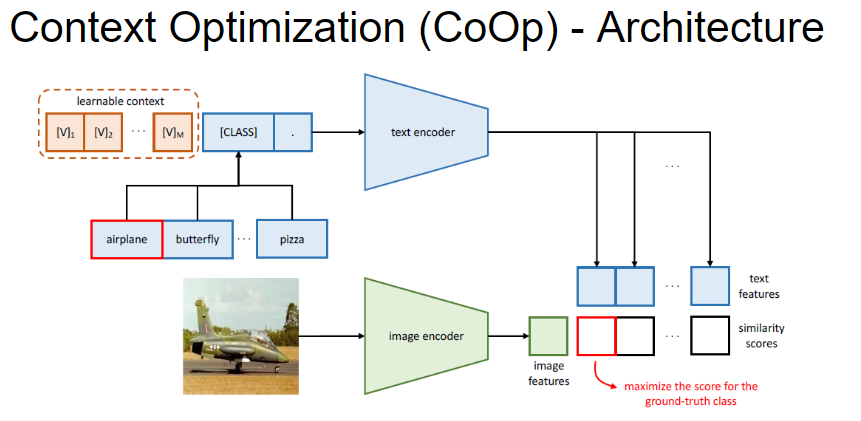
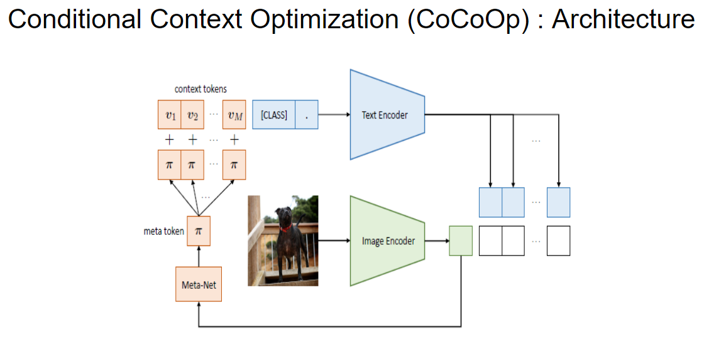
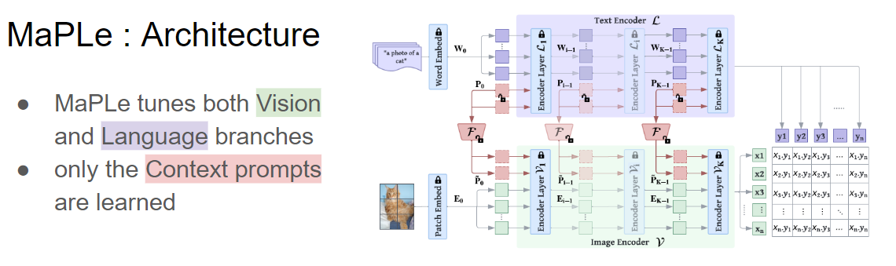
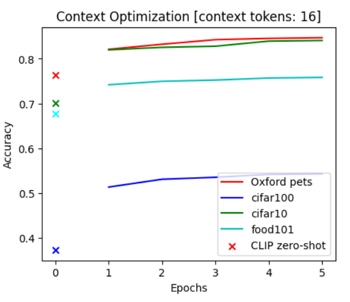
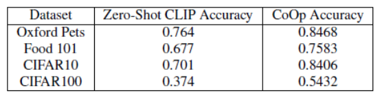

# Learning Prompts for Transfer Learning

Project for the 'Trends and Application of Computer Vision' course of the Master's Degree in Artificial Intelligence Systems at the University of Trento, A.Y. 2023/2024.

## Description
Large pre-trained vision-language models like CLIP
have shown great potential in learning representations that are
transferable across a wide range of downstream tasks. Inspired
by the Natural Language Processing (NLP) literature, recent
CLIP adaptation approaches learn prompts as the textual inputs
to fine-tune CLIP for downstream tasks. 
Further details here [project paper](CV_Report.pdf).

## Models


*Context Optimization (CoOp) Architecture.*
[Click here for the original paper](https://arxiv.org/pdf/2109.01134.pdf)



*Conditional Context Optimization (CoCoOp) Architecture.*
[Click here for the original paper](https://arxiv.org/pdf/2203.05557.pdf)



*Multi-modal Prompt Learning (MaPLe) Architecture.*
[Click here for the original paper](https://arxiv.org/pdf/2210.03117.pdf)

## Results


*The results show how learning the prompts via Context Optimization may enhance the classification against zero-shot CLIP.*

## UMAP

*UMAP of the CLIP embedding space. The learned textual prompts representations are closer to the visual representation respect to the zero-shot textual representations ('a photo of a <class>')*

## Dependencies
The project is written in Python 3.11. The required packages are listed in the [requirements](requirements.txt) file.

## Installation
1. To avoid possible conflicts, it is recommended to use a **virtual environment** to install the required packages. 
    ```
    python3 -m venv prompt-learning
    source prompt-learning/bin/activate
    ``` 

2. To install the project, clone the repository and install the required packages with the following command:
    ```
    pip install -r requirements.txt
    ```

## How to run the program

The program can be run with the following command:

    ```
    python3 main.py -e <epochs> -b <batch size> 
    ```

  - Help:
      ```
      python3 <program.py> -h
      ```

**Note:** The weights of the network will be saved in a folder called 'weights'.
